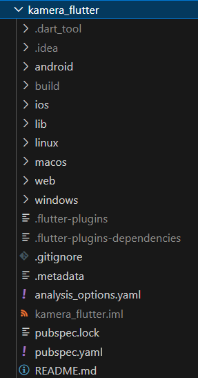
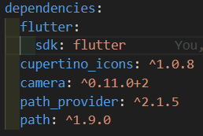
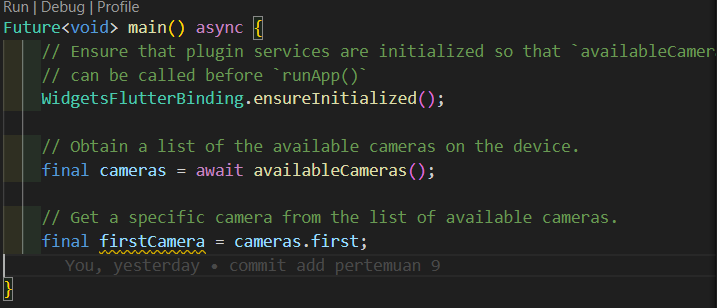
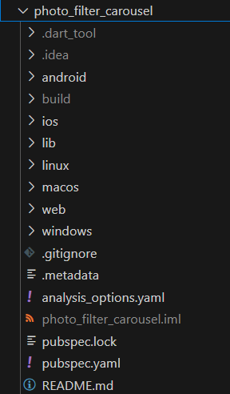

# **Pemrograman Mobile Pertemuan Minggu 9**

| Nama  :   | Haidar Aly |
| :--------: | :-------: |

| Kelas :  | TI-3F    |
| :--------: | :-------: |

| Absen : |  09  |
| :--------: | :-------: |

| NIM   :  | 2241720258   |
| :--------: | :-------: |

## Praktikum 1

### Langkah 1 - Membuat Project Baru
<>

### Langkah 2 - Menambahkan Dependency
<>

### Langkah 3 - Ambil Sensor Kamera Dari Device
<>

### Langkah 4 - Buat dan Inisialisasi `CameraController`
#### `takepicture_screen.dart`
```dart
import 'package:camera/camera.dart';
import 'package:flutter/material.dart';
import 'package:kamera_flutter/widget/displaypicture_screen.dart';

class TakepictureScreen extends StatefulWidget {
  const TakepictureScreen({
    super.key,
    required this.camera,
  });

  final CameraDescription camera;

  @override
  TakePictureScreenState createState() => TakePictureScreenState();
}

class TakePictureScreenState extends State<TakepictureScreen>{
  late CameraController _controller;
  late Future<void> _initializeControllerFuture;

  @override
  void initState(){
    super.initState();
    _controller = CameraController(
      widget.camera,
      ResolutionPreset.medium,
    );

    _initializeControllerFuture = _controller.initialize();
  }

  @override
  void dispose(){
    _controller.dispose();
    super.dispose();
  }      
```

### Langkah 5 - Gunakan `CameraPreview` Untuk Menampilkan Preview Foto
#### `takepicture_screen.dart`
```dart
@override
  Widget build(BuildContext context) {
    return Scaffold(
      appBar: AppBar(title: const Text('Take a picture')),
      body: FutureBuilder<void>(
        future: _initializeControllerFuture,
        builder: (context, snapshot){
          if(snapshot.connectionState == ConnectionState.done){
            return CameraPreview(_controller);
          } else {
            return const Center(child: CircularProgressIndicator());
          }
        },
      ),
```

### Langkah 6 - Ambil foto dengan `CameraController`
#### `takepicture_screen.dart`
```dart
floatingActionButton: FloatingActionButton(
        onPressed: () async {
          try {
            await _initializeControllerFuture;

            final image = await _controller.takePicture();
          } catch (e) {
            print(e);
          }
        },
        child: const Icon(Icons.camera_alt),
      ),
    );
  }
}
```

### Langkah 7 - Buat Widget Baru `DisplayPictureScreen`
#### `displaypicture_screen.dart`
```dart
import 'dart:io';

import 'package:flutter/material.dart';

class DisplaypictureScreen extends StatelessWidget {
  final String imagePath;

  const DisplaypictureScreen({Key? key, required this.imagePath});

  @override
  Widget build(BuildContext context) {
    return Scaffold(
      appBar: AppBar(title: const Text('Display the Picture')),
      body: Image.file(File(imagePath)),
    );
  }
}
```

### Langkah 8 - Edit `main.dart`
```dart
runApp(
    MaterialApp(
        theme: ThemeData.dark(),
        home: TakepictureScreen(
            camera: firstCamera,
        ),
        debugShowCheckedModeBanner: false,
    ),
);
```

### Langkah 9 - Menampilkan Hasil Foto
#### `takepicture_screen.dart`
```dart
floatingActionButton: FloatingActionButton(
    onPressed: () async {
        try {
            await _initializeControllerFuture;

            final image = await _controller.takePicture();

            if (!context.mounted) return;

            await Navigator.of(context).push(
              MaterialPageRoute(
                builder: (context) => DisplaypictureScreen(
                  imagePath: image.path
                ),
              ),
            );
          } catch (e) {
            print(e);
          }
        },
        child: const Icon(Icons.camera_alt),
      ),
    );
  }
}
```

### Hasil
<>

## Praktikum 2

### Langkah 1 - Buat Project Baru
<>

### Langkah 2 - Buat Widget Selector Ring dan Dark Gradient
#### `filter_selector.dart`
```dart
import 'package:flutter/material.dart';
import 'package:flutter/rendering.dart';
import 'package:photo_filter_carousel/widget/carousel_flowdelegate.dart';
import 'package:photo_filter_carousel/widget/filter_item.dart';

@immutable
class FilterSelector extends StatefulWidget {
  const FilterSelector({
    super.key,
    required this.filters,
    required this.onFilterChanged,
    this.padding = const EdgeInsets.symmetric(vertical: 24),
  });

  final List<Color> filters;
  final void Function(Color selectedColor) onFilterChanged;
  final EdgeInsets padding;

  @override
  State<FilterSelector> createState() => _FilterSelectorState();
}

class _FilterSelectorState extends State<FilterSelector> {
  static const _filtersPerScreen = 5;
  static const _viewportFractionPerItem = 1.0 / _filtersPerScreen;

  late final PageController _controller;
  late int _page;

  int get filterCount => widget.filters.length;

  Color itemColor(int index) => widget.filters[index % filterCount];

  @override
  void initState() {
    super.initState();
    _page = 0;
    _controller = PageController(
      initialPage: _page,
      viewportFraction: _viewportFractionPerItem,
    );
    _controller.addListener(_onPageChanged);
  }

  void _onPageChanged() {
    final page = (_controller.page ?? 0).round();
    if (page != _page) {
      _page = page;
      widget.onFilterChanged(widget.filters[page]);
    }
  }

  void _onFilterTapped(int index) {
    _controller.animateToPage(
      index,
      duration: const Duration(milliseconds: 450),
      curve: Curves.ease,
    );
  }

  @override
  void dispose() {
    _controller.dispose();
    super.dispose();
  }

  @override
  Widget build(BuildContext context) {
    return Scrollable(
      controller: _controller,
      axisDirection: AxisDirection.right,
      physics: const PageScrollPhysics(),
      viewportBuilder: (context, viewportOffset) {
        return LayoutBuilder(
          builder: (context, constraints) {
            final itemSize = constraints.maxWidth * _viewportFractionPerItem;
            viewportOffset
              ..applyViewportDimension(constraints.maxWidth)
              ..applyContentDimensions(0.0, itemSize * (filterCount - 1));

            return Stack(
              alignment: Alignment.bottomCenter,
              children: [
                _buildShadowGradient(itemSize),
                _buildCarousel(
                  viewportOffset: viewportOffset,
                  itemSize: itemSize,
                ),
                _buildSelectionRing(itemSize),
              ],
            );
          },
        );
      },
    );
  }

  Widget _buildShadowGradient(double itemSize) {
    return SizedBox(
      height: itemSize * 2 + widget.padding.vertical,
      child: const DecoratedBox(
        decoration: BoxDecoration(
          gradient: LinearGradient(
            begin: Alignment.topCenter,
            end: Alignment.bottomCenter,
            colors: [
              Colors.transparent,
              Colors.black,
            ],
          ),
        ),
        child: SizedBox.expand(),
      ),
    );
  }

  Widget _buildCarousel({
    required ViewportOffset viewportOffset,
    required double itemSize,
  }) {
    return Container(
      height: itemSize,
      margin: widget.padding,
      child: Flow(
        delegate: CarouselFlowdelegate(
          viewportOffset: viewportOffset,
          filtersPerScreen: _filtersPerScreen,
        ),
        children: [
          for (int i = 0; i < filterCount; i++)
            FilterItem(
              onFilterSelected: () => _onFilterTapped(i),
              color: itemColor(i),
            ),
        ],
      ),
    );
  }

  Widget _buildSelectionRing(double itemSize) {
    return IgnorePointer(
      child: Padding(
        padding: widget.padding,
        child: SizedBox(
          width: itemSize,
          height: itemSize,
          child: const DecoratedBox(
            decoration: BoxDecoration(
              shape: BoxShape.circle,
              border: Border.fromBorderSide(
                BorderSide(width: 6, color: Colors.white),
              ),
            ),
          ),
        ),
      ),
    );
  }
}
```

### Langkah 3 - Buat Widget Photo Filter 
#### `filter_carousel.dart`
```dart
import 'package:flutter/material.dart';
import 'package:photo_filter_carousel/widget/filter_selector.dart';

@immutable
class PhotoFilterCarousel extends StatefulWidget {
  const PhotoFilterCarousel({super.key});

  @override
  State<PhotoFilterCarousel> createState() => _PhotoFilterCarouselState();
}

class _PhotoFilterCarouselState extends State<PhotoFilterCarousel> {
  final _filters = [
    Colors.white,
    ...List.generate(
      Colors.primaries.length,
      (index) => Colors.primaries[(index * 4) % Colors.primaries.length],
    )
  ];

  final _filterColor = ValueNotifier<Color>(Colors.white);

  void _onFilterChanged(Color value) {
    _filterColor.value = value;
  }

  @override
  Widget build(BuildContext context) {
    return Material(
      color: Colors.black,
      child: Stack(
        children: [
          Positioned.fill(
            child: _buildPhotoWithFilter(),
          ),
          Positioned(
            left: 0.0,
            right: 0.0,
            bottom: 0.0,
            child: _buildFilterSelector(),
          ),
        ],
      ),
    );
  }

  Widget _buildPhotoWithFilter() {
    return ValueListenableBuilder(
      valueListenable: _filterColor,
      builder: (context, color, child) {
        // Anda bisa ganti dengan foto Anda sendiri
        return Image.network(
          'https://docs.flutter.dev/cookbook/img-files'
          '/effects/instagram-buttons/millennial-dude.jpg',
          color: color.withOpacity(0.5),
          colorBlendMode: BlendMode.color,
          fit: BoxFit.cover,
        );
      },
    );
  }

  Widget _buildFilterSelector() {
    return FilterSelector(
      onFilterChanged: _onFilterChanged,
      filters: _filters,
    );
  }
}
```

### Langkah 4 - Membuat Filter Warna - Bagian 1
#### `carousel_flowdelegate.dart`
```dart
import 'package:flutter/material.dart';
import 'package:flutter/rendering.dart';
import 'dart:math' as math;

class CarouselFlowdelegate extends FlowDelegate {
  CarouselFlowdelegate({
    required this.viewportOffset,
    required this.filtersPerScreen,
  }) : super(repaint: viewportOffset);

  final ViewportOffset viewportOffset;
  final int filtersPerScreen;

  @override
  void paintChildren(FlowPaintingContext context) {
    final count = context.childCount;

    final size = context.size.width;

    final itemExtent = size / filtersPerScreen;

    final active = viewportOffset.pixels / itemExtent;

    final min = math.max(0, active.floor() - 3).toInt();

    // Index of the last item we need to paint at this moment.
    // At most, we paint 3 items to the right of the active item.
    final max = math.min(count - 1, active.ceil() + 3).toInt();

    // Generate transforms for the visible items and sort by distance.
    for (var index = min; index <= max; index++) {
      final itemXFromCenter = itemExtent * index - viewportOffset.pixels;
      final percentFromCenter = 1.0 - (itemXFromCenter / (size / 2)).abs();
      final itemScale = 0.5 + (percentFromCenter * 0.5);
      final opacity = 0.25 + (percentFromCenter * 0.75);

      final itemTransform = Matrix4.identity()
        ..translate((size - itemExtent) / 2)
        ..translate(itemXFromCenter)
        ..translate(itemExtent / 2, itemExtent / 2)
        ..multiply(Matrix4.diagonal3Values(itemScale, itemScale, 1.0))
        ..translate(-itemExtent / 2, -itemExtent / 2);

      context.paintChild(
        index,
        transform: itemTransform,
        opacity: opacity,
      );
    }
  }

  @override
  bool shouldRepaint(covariant CarouselFlowdelegate oldDelegate) {
    return oldDelegate.viewportOffset != viewportOffset;
  }
}
```

### Langkah 5 - Membuat Filter Warna
```dart
import 'package:flutter/material.dart';

class FilterItem extends StatelessWidget {
  const FilterItem({
    super.key,
    required this.color,
    this.onFilterSelected,
  });

  final Color color;
  final VoidCallback? onFilterSelected;

  @override
  Widget build(BuildContext context) {
    return GestureDetector(
      onTap: onFilterSelected,
      child: AspectRatio(
        aspectRatio: 1.0,
        child: Padding(
          padding: const EdgeInsets.all(8),
          child: ClipOval(
            child: Image.network(
              'https://docs.flutter.dev/cookbook/img-files'
              '/effects/instagram-buttons/millennial-texture.jpg',
              color: color.withOpacity(0.5),
              colorBlendMode: BlendMode.hardLight,
            ),
          ),
        ),
      ),
    );
  }
}
```

### Langkah 6 - Implementasi Carousel
```dart
import 'package:flutter/material.dart';
import 'package:photo_filter_carousel/widget/filter_carousel.dart';

void main() {
  runApp(
    const MaterialApp(
      home: PhotoFilterCarousel(),
      debugShowCheckedModeBanner: false,
    ),
  );
}
```

### Hasil
<>

## Tugas
1. Gabungan kode-kode di atas untuk membuat aplikasi Photo Filter Carousel.
- <>

2. Jelaskan maksud `void async` pada praktikum 1?
- Void async adalah sebuah fungsi yang dapat dipanggil secara asynchronous, artinya fungsi tersebut dapat dipanggil secara berbeda-beda dalam waktu yang sama. Fungsi ini dapat digunakan untuk melakukan operasi yang membutuhkan waktu lama, seperti mengakses database atau melakukan proses komputasi yang kompleks.

3. Jelaskan fungsi dari anotasi `@immutable` dan `@override` ?
- Anotasi @immutable digunakan dalam bahasa pemrograman Dart, khususnya dalam framework Flutter. Anotasi ini menunjukkan bahwa semua field dalam sebuah class bersifat final, artinya nilai dari field-field tersebut tidak dapat diubah setelah objek dibuat. Ini membantu dalam menciptakan objek yang tidak dapat diubah (immutable), yang dapat meningkatkan keandalan dan prediktabilitas kode. sedangkan Anotasi @override digunakan untuk menunjukkan bahwa sebuah metode dalam subclass menimpa (override) metode dengan nama yang sama dalam superclass. Ini membantu dalam memastikan bahwa metode yang dimaksud benar-benar ada dalam superclass dan menghindari kesalahan penulisan atau perubahan yang tidak disengaja.